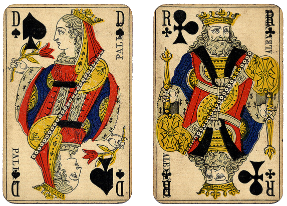

- title : Introduction to functional data types in F#
- description : Introduction to React Native with F#
- author : Mark Vincze
- theme : white
- transition : none

***

# Introduction to<br />functional data types in F#

<br />
<br />
Mark Vincze - [@mrkvincze](http://www.twitter.com/mrkvincze)

***

## The plan

1. Sample problem
1. Implement in C#
1. Basics of F# data types
1. Implement in F#

***

## The exercise

<ul>
    <li>Implement a data model for the standard 52-card deck (French playing cards)</li>
        </img>
    <ul>
        <li>4 suits: <span style="color: red"> ♦ ♥ </span> ♣ ♠</li>
        <li>9 value cards from 2 to 10</li>
        <li>4 face cards: Jack, Queen, King, Ace</li>
        <li>Special card without a suit: Joker</li>
    </ul>
</ul>

<div style="text-align: right; font-size: 14px; clear: both; margin-top: 24px">
    <a href="https://www.flickr.com/photos/crackdog/5379514209/">Image: Vintage French playing card by William Creswell, License: CC 2.0</a>
</div>

*** 

## Additional requirements

1. **Implement a standalone data model, not tied to any algorithm**
1. **Adhere to Domain Driven Design**  
Main principles

 - Use terminology natural to domain experts
 - Make illegal states not representable

***

## "Business" logic example:<br />Rummy scoring

- Calculate the score of a card in Rummy
 - Queen of spades: 40
 - Aces: 15
 - Other face cards: 10
 - 10s: 10
 - Everything else: 5

***

## Data models in OO languages

- Immutability is not the default
- "Either" is not easy to express
- Inheritance and pure data do not play well

*** 

## Data types in FP languages

- Immutability by default
- Composability
- Value semantics
- Originates from set theory and category theory

*** 

## Record

- Immutable reference type objects

```
type Person = {
    FirstName : string
    LastName : string
    Age : int
}
```

***

## Record

- Immutable by default

```
type Person = {
    FirstName : string
    LastName : string
    Age : int
}

let p = { FirstName = "Jane"; LastName = "Smith"; Age = 25 }

p.Age <- 30 // This doesn't compile
```

***

## Record

- Opt-in for mutability

```
type Person = {
    FirstName : string
    LastName : string
    mutable Age : int
}

let p = { FirstName = "Jane"; LastName = "Smith"; Age = 25 }

p.Age <- 30 // Now this works
```

***

## Tuple

 - Multiple values put together

```
let point = (1.5, 4.3)  
let personWithAge = ("Jane Smith", 25) 

let x, y = point

type MyTuple = string * int * Person
```

***

## Tuple

Also called: **Product type**

<div>
    <div style="display: inline-block;">
        <h2>A</h2>
        <table>
            <tr><td>a1</tr></td>
            <tr><td>a2</tr></td>
            <tr><td>a3</tr></td>
        </table>
    </div>
    <div style="display: inline-block;">
        <h2>*</h2>
    </div>
    <div style="display: inline-block;">
        <h2>B</h2>
        <table>
            <tr><td>b1</tr></td>
            <tr><td>b2</tr></td>
        </table>
    </div>
    <div style="display: inline-block;">
        <h2>=</h2>
    </div>
    <div style="display: inline-block;">
        <h2>A*B</h2>
        <table>
            <tr><td>a1, b1</tr></td>
            <tr><td>a2, b1</tr></td>
            <tr><td>a3, b1</tr></td>
            <tr><td>a1, b2</tr></td>
            <tr><td>a2, b2</tr></td>
            <tr><td>a3, b2</tr></td>
        </table>
    </div>
</div>

***

## Discriminated union

- Represents a choice of multiple options  
Example without data

```
type LoggingLevel =  
| Debug
| Info
| Error

let level = Info
```

***

## Discriminated union

- Every case can have a value  
Example

```
type Shape =  
| Circle of radius : float
| Rectangle of width : float * height : float

let circ = Circle (2.0) 
let rect = Rectangle (width = 10.0, height = 2.3)
```

***

## Discriminated union

- Usage, pattern matching

```
let calculateArea shape =  
    match shape with
    | Rectangle (w, h) -> w * h
    | Circle r -> r * r * 3.14

let circleArea = calculateArea (Circle 5)
```

***

## Discriminated union

Also called: **Sum type**

<div>
    <div style="display: inline-block;">
        <h2>A</h2>
        <table>
            <tr><td>a1</tr></td>
            <tr><td>a2</tr></td>
            <tr><td>a3</tr></td>
        </table>
    </div>
    <div style="display: inline-block;">
        <h2>+</h2>
    </div>
    <div style="display: inline-block;">
        <h2>B</h2>
        <table>
            <tr><td>b1</tr></td>
            <tr><td>b2</tr></td>
        </table>
    </div>
    <div style="display: inline-block;">
        <h2>=</h2>
    </div>
    <div style="display: inline-block;">
        <h2>A+B</h2>
        <table>
            <tr><td>A a1</tr></td>
            <tr><td>A a2</tr></td>
            <tr><td>A a3</tr></td>
            <tr><td>B b1</tr></td>
            <tr><td>B b2</tr></td>
        </table>
    </div>
</div>

***

## Discriminated unions in practice

```
type OperationResult =  
| Success of data : Data
| NotFound
| Error of errorMessage : string

type HttpRequest =  
| Get of url : string
| Post of url : string * body : byte array

type Credentials =  
| UserPass of user : string * password : string
| Certificate of certFilePath : string
| None
```

***

### Thank you!

- More details: https://blog.markvincze.com/a-data-model-exercise-in-two-languages-part-1-c
- F# reference: https://fsharpforfunandprofit.com
- FizzBuzz in C#, Haskell and Clojure: https://vimeo.com/180578019
- A more complex DDD example in F#: https://vimeo.com/162036084
- F# intro for C# devs: https://www.youtube.com/watch?v=KPa8Yw_Navk
- Functional Domain Modeling with F#: https://www.youtube.com/watch?v=Up7LcbGZFuo